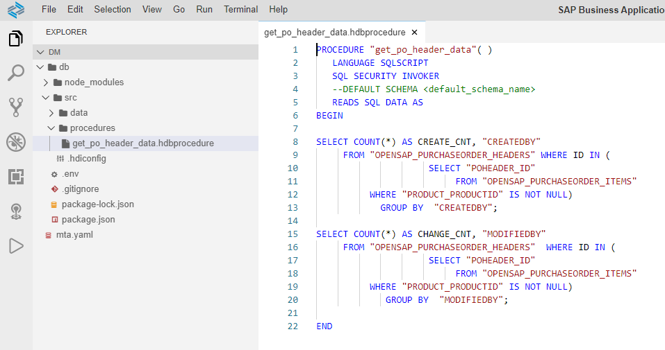
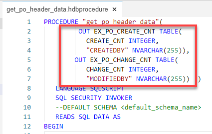
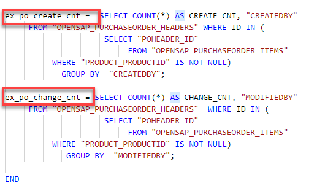

# QWERT Parallel Processing and Parameters TestParser six
<!-- description --> Leverage SQLScript in stored procedures, user defined functions, and user defined libraries.

## Prerequisites  
- This tutorial is designed for #SAP HANA Cloud.
- **Proficiency:** Intermediate
- **Test:** yohoho
- **Tutorials:** [Configuring Eclipse with SAP HANA Cloud Platform Tools for Java](https://github.com/mamosova/tutorials/edit/master/tutorials/test1111/accardion.md)
- **Web iDE:** Configuring Eclipse with SAP HANA Cloud Platform Tools for Java

## You will learn  
- How to take full advantage of parallel # processing in SAP HANA by using table variables

## Intro
In this exercise, we will modify the code of procedure `get_po_header_data`  so that it takes full advantage of the parallel processing within HANA by using table variables.

---

### Images with border, video


1. Return to your procedure called `get_po_header_data`.

    <!-- border -->

2. Define two tabular output parameters which will be used to ### explicitly pass the results of the SELECT statements to the caller.

    <!-- border -->

3. Next, assign SELECT statements to the output parameters as shown here.

    <!-- border -->
    
    DAM video:
[EMBEDDED-VIDEO [](/content/dam/site/sapcom/multimedia/2017/12/746085f5-e27c-0010-82c7-eda71af511fa.mp4)]

Video in iframe:
<iframe width="560" height="315" src="https://www.youtube.com/embed/IRnt2_dDxzI" title="YouTube video player" frameborder="0" allow="accelerometer; autoplay; clipboard-write; encrypted-media; gyroscope; picture-in-picture" allowfullscreen></iframe>

4. The completed code should be similar to this.

    ```SQLCRIPT
    PROCEDURE "get_po_header_data"(
             OUT EX_PO_CREATE_CNT ### TABLE(
               CREATE_CNT INTEGER,
               "CREATEDBY" NVARCHAR(255)),
            OUT EX_PO_CHANGE_CNT TABLE(
               CHANGE_CNT INTEGER,
               "MODIFIEDBY" NVARCHAR(255))  )
       LANGUAGE SQLSCRIPT
       SQL SECURITY INVOKER
       --DEFAULT SCHEMA <default_schema_name>
       READS SQL DATA AS
    BEGIN

    ex_po_create_cnt =  SELECT COUNT(*) AS CREATE_CNT, "CREATEDBY"
         FROM "OPENSAP_PURCHASEORDER_HEADERS" WHERE ID IN (
                         SELECT "POHEADER_ID"
                              FROM "OPENSAP_PURCHASEORDER_ITEMS"
              WHERE "PRODUCT_PRODUCTID" IS NOT NULL)
                GROUP BY  "CREATEDBY";

    ex_po_change_cnt = SELECT COUNT(*) AS CHANGE_CNT, "MODIFIEDBY"
         FROM "OPENSAP_PURCHASEORDER_HEADERS"  WHERE ID IN (
                         SELECT "POHEADER_ID"
                              FROM "OPENSAP_PURCHASEORDER_ITEMS"
              WHERE "PRODUCT_PRODUCTID" IS NOT NULL)
                 GROUP BY  "MODIFIEDBY";

    END
    ```


### Accordion component which contains tables in Body


***Tables:***

  **Example:** 

[EMBEDDED-VIDEO [](/content/dam/site/sapcom/multimedia/2017/12/746085f5-e27c-0010-82c7-eda71af511fa.mp4)]

First Header | Second Header
------------ | -------------
Content from cell 1 | Content from cell 2
Content in the first column | Content in the second column


and

| Left-Aligned  | Center Aligned  | Right Aligned |
| :------------ |:---------------:| -----:|
| col 3 is      | some wordy text | $1600 |
| col 2 is      | centered        |   $12 |
| zebra stripes | are neat        |    $1 |

[EMBEDDED-VIDEO [](/content/dam/site/sapcom/multimedia/2017/12/746085f5-e27c-0010-82c7-eda71af511fa.mp4)]


[ACCORDION-BEGIN [STEP 3](Accordion component which contains Headers in Body)]
***Headers***

  **Example:** 

[EMBEDDED-VIDEO [](/content/dam/site/sapcom/multimedia/2017/12/746085f5-e27c-0010-82c7-eda71af511fa.mp4)]
## This is an h2 header

[EMBEDDED-VIDEO [](/content/dam/site/sapcom/multimedia/2017/12/746085f5-e27c-0010-82c7-eda71af511fa.mp4)]
### This is an h3 header

[EMBEDDED-VIDEO [](/content/dam/site/sapcom/multimedia/2017/12/746085f5-e27c-0010-82c7-eda71af511fa.mp4)]
###### This is an h6 header


[ACCORDION-BEGIN [STEP 4](Accordion component which contains Lists in Body)]
***Lists***

  **Example:** 
  
Sometimes you want numbered lists:

[EMBEDDED-VIDEO [](/content/dam/site/sapcom/multimedia/2017/12/746085f5-e27c-0010-82c7-eda71af511fa.mp4)]
1. One
2. Two 
3. Three

Sometimes you want bullet points:

[EMBEDDED-VIDEO [](/content/dam/site/sapcom/multimedia/2017/12/746085f5-e27c-0010-82c7-eda71af511fa.mp4)]
* Start a line with a star
* Profit!


[ACCORDION-BEGIN [STEP 5](Accordion component which contains nested lists in Body)]
You can create nested lists: 

[EMBEDDED-VIDEO [](/content/dam/site/sapcom/multimedia/2017/12/746085f5-e27c-0010-82c7-eda71af511fa.mp4)]
* item1
    * one_one
    * two


[ACCORDION-BEGIN [STEP 6](Accordion component which contains Blockquotes in Body)]
***Blockquotes***

  **Example:** 
In the words of Abraham Lincoln:

[EMBEDDED-VIDEO [](/content/dam/site/sapcom/multimedia/2017/12/746085f5-e27c-0010-82c7-eda71af511fa.mp4)]
> Pardon my French


[ACCORDION-BEGIN [STEP 7](Accordion component which contains types of messages (Note, Caution and Warning) in Body)]
***There are three different types of messages: Note, Caution and Warning.***

[EMBEDDED-VIDEO [](/content/dam/site/sapcom/multimedia/2017/12/746085f5-e27c-0010-82c7-eda71af511fa.mp4)]
>### Warning
>jhkjhkjhkjhkj
>>### Warning
>>>### Warning
>>>>### Warning
>>>>This is a Warning. 

&nbsp;

>### Caution
>iikjhiojhioji
>>### Caution
>>This is a Caution. 

&nbsp;

>### Note

>This is a note. 


[ACCORDION-BEGIN [STEP 8](Accordion component which contains Task Lists in Body)]
**Task Lists*** (Please note, this requires empty line before task list):

  **Example:** 
  
  [EMBEDDED-VIDEO [](/content/dam/site/sapcom/multimedia/2017/12/746085f5-e27c-0010-82c7-eda71af511fa.mp4)]  
- [x] @mentions, #refs, [links](), **formatting**, and ~~tags~~ supported
- [x] list syntax required (any unordered or ordered list supported)
- [x] this is a complete item
- [ ] this is an incomplete item


[ACCORDION-BEGIN [STEP 9](Accordion component which contains code block and no code block in Body)]
***Code blocks:***

[EMBEDDED-VIDEO [](/content/dam/site/sapcom/multimedia/2017/12/746085f5-e27c-0010-82c7-eda71af511fa.mp4)]

```markup
 quit;
 !@#$%^&*&*(*(()_++|"}?><>??*&^%#!~~~~@33123-090=|"]?>{}|\\
  require 'redcarpet'
  markdown = Redcarpet.new("Hello World!")
  puts markdown.to_html
  exit;
```

```js
 quit;
 !@#$%^&*&*(*(()_++|"}?><>??*&^%#!~~~~@33123-090=|"]?>{}|\\
  require 'redcarpet'
  markdown = Redcarpet.new("Hello World!")
  puts markdown.to_html
  exit;
```

[EMBEDDED-VIDEO [](/content/dam/site/sapcom/multimedia/2017/12/746085f5-e27c-0010-82c7-eda71af511fa.mp4)]


---
